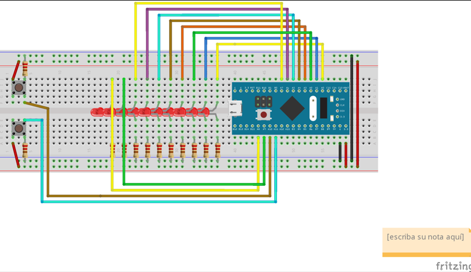

# STM32 Interrupt-Driven LED Counter

A low-level STM32 project written in ARM assembly that drives a 10-bit LED counter using EXTI button interrupts and SysTick timing.

The project uses 10 LEDs to display the binary value of a counter. One button changes the counter speed from **x1** to **x4**, while another button changes the counting direction. The implementation is based on direct GPIO configuration, interrupt handling, and timer-driven control on an STM32 Blue Pill board.

> **Current scope**: GPIO setup, EXTI interrupt handling, SysTick initialization, speed control, direction changes, binary LED output, assembly build process, and flashing the generated binary to an STM32 Blue Pill board.

---

## Contents

- [Overview](#overview)
- [System Behavior](#system-behavior)
- [Hardware and Software Requirements](#hardware-and-software-requirements)
- [Required Toolchain](#required-toolchain)
- [Build and Flash](#build-and-flash)
- [Implementation Overview](#implementation-overview)
- [Delay Routine](#delay-routine)
- [SysTick Initialization](#systick-initialization)
- [SysTick Handler](#systick-handler)
- [Main Routine](#main-routine)
- [Speed Control](#speed-control)
- [EXTI Interrupt Handler](#exti-interrupt-handler)
- [Hardware Configuration Diagram](#hardware-configuration-diagram)
- [Notes](#notes)

---

## Overview

This project implements a binary LED counter on an STM32 Blue Pill board using ARM assembly.

The counter value is displayed through **10 LEDs**, where each LED represents one bit of the current value. Button inputs are handled through **external interrupts (EXTI)**, and timing behavior is controlled through **SysTick**.

The project focuses on:

- low-level GPIO control
- interrupt-driven input handling
- timer-based control with SysTick
- binary output through LEDs
- ARM assembly implementation on STM32

---

## System Behavior

The application displays a binary counter using 10 LEDs.

The main behavior is:

- the LEDs show the current counter value in binary
- one button changes the update speed from **x1** to **x4**
- another button changes the counting direction
- the counter is updated over time using SysTick-based timing

This creates a simple interrupt-driven firmware example where hardware input changes the runtime behavior of the counter.

---

## Hardware and Software Requirements

### Hardware
- STM32 Blue Pill board
- 10 LEDs
- 2 push buttons
- ST-Link programmer
- Circuit wiring based on the included diagram

### Software
- ARM cross-compilation toolchain
- ST-Link utilities
- STM32CubeProgrammer
- MinGW or equivalent terminal environment
- `make`

---

## Required Toolchain

The project requires a standard ARM embedded toolchain for assembling, linking, and generating the binary file for the microcontroller.

Typical tools used:

- `arm-none-eabi-gcc`
- `arm-none-eabi-as`
- `arm-none-eabi-objdump`
- `arm-none-eabi-objcopy`

Optional aliases:

```bash
alias arm-gcc=arm-none-eabi-gcc
alias arm-as=arm-none-eabi-as
alias arm-objdump=arm-none-eabi-objdump
alias arm-objcopy=arm-none-eabi-objcopy
```

Additional required tools:

- ST-Link packages
- STM32CubeProgrammer for flashing the generated binary

---

## Build and Flash

If the project was cloned from GitHub and includes repository-specific linking logic, unlink it first if needed:

```bash
make unlink
```

Clean previous object files:

```bash
make clean
```

Build the project:

```bash
make
```

This process generates the corresponding object files and the final binary file, typically:

```text
prog.bin
```

To flash the board:

1. Open **STM32CubeProgrammer**
2. Connect the Blue Pill board through ST-Link
3. Select the target memory address:
   ```text
   0x08000000
   ```
4. Load `prog.bin`
5. Start the flashing process

---

## Implementation Overview

The project is organized around the following low-level components:

- GPIO configuration for LED outputs and button inputs
- SysTick setup for timing control
- interrupt handling through EXTI lines
- speed adjustment logic
- direction control logic
- binary output through 10 LEDs

The implementation is written in ARM assembly and works directly with STM32 registers.

---

## Delay Routine

The `delay` routine is implemented as a loop that slows down execution.

It uses register comparisons to keep the processor in a wait cycle until the delay count reaches zero. This routine helps create visible timing differences in the LED counter behavior.

Its purpose is to:

- slow down counter updates
- support visible changes in output speed
- provide a simple software-based delay mechanism

---

## SysTick Initialization

The `SysTick_initialize` routine configures the SysTick timer for periodic timing control.

Its main steps are:

- initialize the **SysTick base address**
- disable the SysTick interrupt while configuring it
- load the interval value into `STK_LOAD_OFFSET`
- clear the current timer value in `STK_VAL_OFFSET`
- set SysTick priority through the system control block
- enable the clock and timer control

This routine prepares SysTick to act as the time base for the counter update behavior.

---

## SysTick Handler

The `SysTick_Handler` routine performs a simple countdown operation by decrementing a register value used for timing control.

In this implementation, it subtracts `1` from `r10`, which is used as part of the timing workflow.

Its purpose is to:

- provide periodic timer ticks
- update the internal countdown state
- support speed-dependent counter timing

---

## Main Routine

As in the previous laboratory setup, the main routine initializes GPIO pins for both outputs and inputs.

### Pin usage
- **PA0 to PA9**: LED outputs
- **PA10 and PA11**: button inputs

The routine then configures:

- GPIO ports
- EXTI lines for button interrupts
- NVIC for interrupt handling
- SysTick for timer-based control

A simplified view of the setup flow is:

```text
1. Configure LED pins as outputs
2. Configure button pins as inputs
3. Configure EXTI for PA10 and PA11
4. Enable EXTI interrupt handling in NVIC
5. Initialize SysTick
6. Run the counter logic using current speed and direction
```

This establishes the complete runtime environment for the application.

---

## Speed Control

The `check_speed` routine controls the counter update speed.

It uses a speed register and maps each speed level to a delay value. The sequence cycles through four different speed settings:

- **speed 1** → delay `1000`
- **speed 2** → delay `500`
- **speed 3** → delay `250`
- **speed 4** → delay `125`

After the highest speed level, it returns to the initial delay.

This provides a simple speed cycle from **x1** to **x4**.

---

## EXTI Interrupt Handler

The EXTI interrupt logic is based on lines **10 and 11**, handled through the `EXTI15_10_Handler`.

The routine checks whether **EXTI10** or **EXTI11** triggered the interrupt and then updates the corresponding runtime behavior.

### EXTI10
Used to update the speed configuration.

### EXTI11
Used to change the counting direction.

The handler works by:

- reading the EXTI pending register
- identifying which interrupt line was triggered
- updating the corresponding control register or variable
- clearing the pending bit so the interrupt can be handled again later

This allows the system to react immediately to button presses without relying only on polling.

---

## Hardware Configuration Diagram

The repository includes the hardware reference diagram used for the project:



---

## Notes

- The project is focused on low-level firmware concepts using ARM assembly on STM32.
- The implementation assumes an STM32 Blue Pill setup and compatible wiring.
- Pin assignments can be adjusted if a different hardware layout is required.
- SysTick is used as the timing source for the counter behavior.
- EXTI lines 10 and 11 are used for button-triggered interrupt handling.
- Build and flashing steps may vary slightly depending on the local toolchain and operating system setup.
